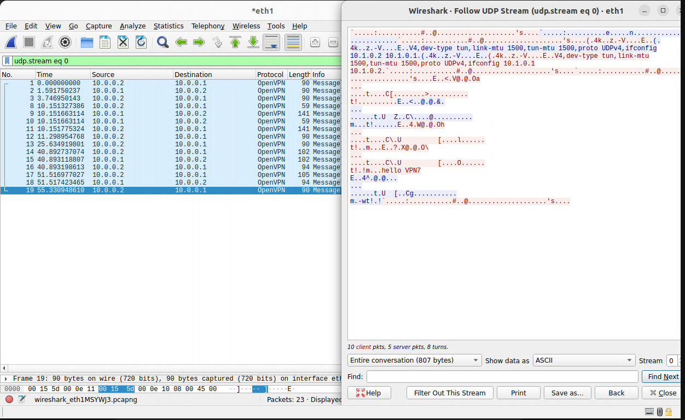
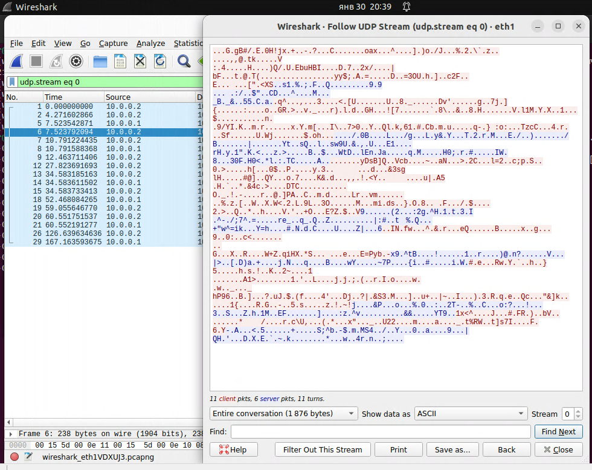
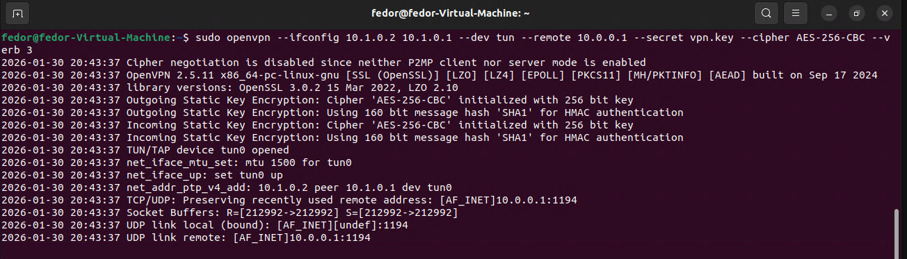
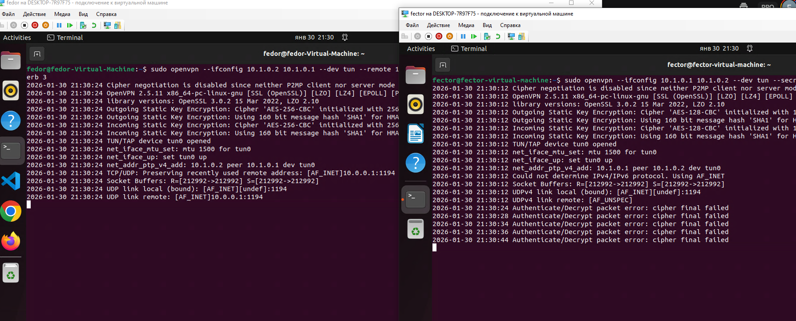

# Домашнее задание к занятию «Виртуальные частные сети (VPN)» - Лунев Федор Владимирович

---

## 1\. Пришлите скриншот Wireshark, где видно, что данные передаются в открытом виде (для раздела PlainText).

На скриншоте продемонстрирован перехват UDP-потока. В окне «Follow UDP Stream» отчетливо читается передаваемый текст `hello VPN7`. Это подтверждает, что данные передаются в незашифрованном виде.

---
## 2\. Пришлите скриншот Wireshark, где видно, что данные не передаются в открытом виде (для раздела Shared Key).

После настройки шифрования (Shared Key) перехваченный трафик стал нечитаемым ("мусор"). Исходное сообщение невозможно извлечь.

---

На сервере или на клиенте запустите команду с флагом `--verb 3`, например, на `Kali - sudo openvpn --ifconfig 10.1.0.2 10.1.0.1 --dev tun --remote 10.0.0.1 --secret vpn.key  --cipher aes-256-cbc --verb 3`

Внимательно изучите вывод и пришлите ответы на следующие вопросы:

---

*(На основе вывода команды с ключом `--verb 3`)*

## 3\. Какая версия OpenSSL используется?
* **Ответ:** `OpenSSL 3.0.2 15 Mar 2022`

## 4\. Какой алгоритм (и с какой длиной ключа) используется для шифрования?
* **Ответ:** Алгоритм `AES-256-CBC`, длина ключа **256 бит**.

## 5\. Какой алгоритм (и с какой длиной ключа) используется для HMAC аутентификации?
* **Ответ:** Алгоритм `SHA1`, длина дайджеста **160 бит**.
*(Лог: `Using 160 bit message hash 'SHA1' for HMAC authentication`)*

---

## 6\. Что будет выведено в консоли сервера (`sudo openvpn --ifconfig 10.1.0.1 10.1.0.2 --dev tun --secret vpn.key --cipher AES128 --auth SHA256 --verb 3`), если:

## 6\.1\. Подключиться с клиента командой: `sudo openvpn --ifconfig 10.1.0.2 10.1.0.1 --dev tun --remote 10.0.0.1 --secret vpn.key --cipher AES256 --auth SHA256 --verb 3`
* **Условия:** Сервер настроен на `AES-128-CBC`, Клиент подключается с `AES-256-CBC`.
* **Результат:** Сервер получает пакет, но не может его расшифровать из-за несовпадения ключей.
* **Текст ошибки в консоли сервера:**
  `Authenticate/Decrypt packet error: cipher final failed`

## 6\.2\. Подключиться с клиента командой: `sudo openvpn --ifconfig 10.1.0.2 10.1.0.1 --dev tun --remote 10.0.0.1 --secret vpn.key --cipher AES128 --auth SHA512 --verb 3`

* **Условия:** Сервер настроен на `SHA256`, Клиент подключается с `SHA512`.
* **Результат:** Пакет отклоняется на этапе проверки целостности (HMAC).
* **Текст ошибки в консоли сервера:**
  `Authenticate/Decrypt packet error: packet HMAC authentication failed`

